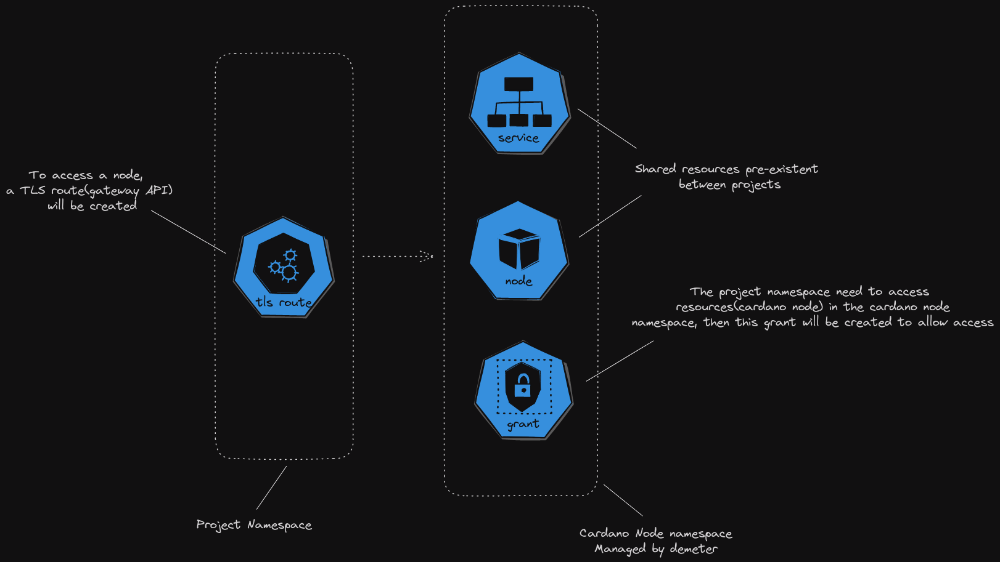

# Ext Cardano Node

This project is a Kubernetes custom controller to allow access to the cardano node instances. This controller defines a new CRD CardanoNodePort on Kubernetes.

The controller will create a TLSroute on project namespace and a grant on node namespace.


## Environment

| Key       | Value               |
| --------- | ------------------- |
| ADDR      | 0.0.0.0:5000        |
| DNS_ZONE  | demeter.run         |
| NAMESPACE | ftr-cardano-node-v1 |

## Commands

To generate the CRD will need to execute crdgen

```bash
cargo run --bin=crdgen
```

and execute the controller

```bash
cargo run
```

## Metrics

to collect metrics for Prometheus, an http api will enable with the route /metrics.

```
/metrics
```
